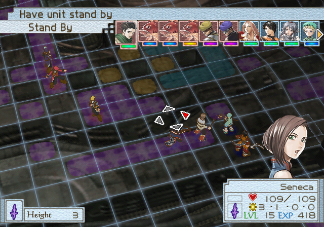
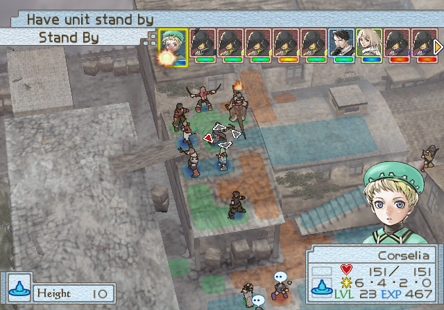
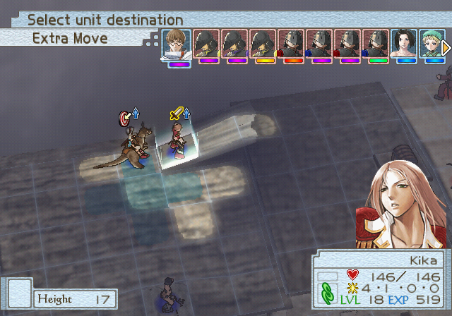

import PartyFormation from '../../components/Suikoden/TacticsGrid.jsx';

<SEO title="Suikoden Tactics any%" />

### Starting Stat Manipulation
This game has a very easy way to manipulate starting stats for all your characters.
Simply reset the console, and hit New Game to get seed 0. Back out, and hit new game again to get seed 1, etc.
Load game works as well.

We are going to use Seed 15, RNG 0x71798ad5 post calculation. 

**To do this, press New Game / Load Game and back out 15 times. Then press New Game, pick your settings, and start the run.**

To confirm correct seed:
- Lazlo HP: 21
- Snowe HP: 22

### Intro Battle
Say no to tutorial

- **Lazlo**: 1 Forward (east)
- **Snowe**: 1 Down 1 Forward
- **Lazlo**: 1 Down, attack
- **Snowe**: 1 Forward, attack

### Intro Battle 2
> Really don't want Kyril to level, Battle at Sea gets way tighter.

Too much variance for set strat. Kill Elemental ASAP, move units towards right. Kyril can bait by moving forward and placing Flame Force Bead on self. Kill left once they get closer.

## A Chance Encounter at Sea
### Caravan

<Menu>

##### Skills
- Andarc: Lightning Magic - D, Godspeed

</Menu>

### Middleport

<Menu>

##### Outfitter (Try On)
- Kyril: Lightning
- Seneca: Water, Flame

##### Blacksmith
- Andarc: 2
- Seneca: 2
- Kyril: 2

</Menu>

Gossip > Read all
Depart

### Battle At Sea
#### Setup
Swap Kyril and Walter

<PartyFormation formation={[
  { name: 'Hervey', x: 0, y: 0 },
  { name: 'Walter', x: 1, y: 1 },
  { name: 'Andarc', x: 2, y: 2 },
  { name: 'Seneca', x: 1, y: 3 },
  { name: 'Kyril', x: 0, y: 4 },
]}/>

##### Beads
- Seneca: Water, Flame
- Kyril: Lightning

#### Strategy
Say no to Tutorial
If Sigurd before Hervey after Standby, retry.

##### Turn 1

---
- *If Blue Mercenary **BEFORE** Seneca*
- **Hervey**: 1 Right 5 Up, Standby face right.
- **Walter**: Move Behind Hervey, Face Right.
- **Seneca**: 2 Behind Hervey, Flame Bead Hervey

---

- *If Blue Mercenary **AFTER** Seneca*
- **Hervey**: 2 Right 4 Up, Standby face up.
- **Walter**: 5 Up, kill Pirate
- **Seneca**: 5 Up, Water Bead 1 Right so it's on her and Hervey. **FACE DOWN**.

---

- **Andarc**: 1 Right 1 Up, Standby
- **Kyril**: 1 Right 5 Up, Lightning Bead 3 Right (2 Right of box)

##### Turn 2
- **Hervey**: 1 Up 3 Right, face left
- **Andarc**: 1 Up 1 Right, Thunder Runner Sigurd

Enter Nest of Pirates

### The Night Sea #1
##### Turn 1
- Say no to Tutorial
- **Brandeau / Edgar**: Move below front Pirate, attack & hopefully kill.
- **Brandeau / Edgar**: Move to closest tile to cannon possible.
- *If 1st failed to kill, move 2 Left 1 Up of 1st person, face forward.*

##### Turn 2
- Step on tile to win.

### The Night Sea #2
> If you finish kill all other Pirates before Kyril's 3rd turn (Fish Spawn), the battle ends.
> Want Andarc LVL2 preferably, so he is slower than Pirates. That way he can Thunder Runner a Pirate.
> Probably want Kyril level 1, just so you have more time.

#### Setup
#### Strategy
##### Turn 1
- **Brandeau**: 1 Down 5 Right, Kill bottom Pirate (Spear). Face Right.
- **Edgar**: 1 Down 5 Right, Kill bottom Pirate (Spear). Face **Left**.
- *Don't know how fight plays out if they miss a kill. Maybe retry?*
- **Andarc**: 3 Right 2 Up, Thunder Runner a Pirate. Face away from enemies.
- *Usually if an enemy has a turn left and there's a Pirate near Edgar aim for that one. Next Pirate will move onto Lightning Tile and Jolly + Rowdy probably kill.*

##### Turn 2
> If Jolly or Rowdy got hit twice, you want to Medicine them with Edgar. If Edgar got stunned, can do it with Brandeau instead. BUT ONLY if Jolly + Rowdy will kill an enemy Pirate.
> Want to aim for the Pirates closer to Steele, the ones closer to you are more likely to target Andarc & Peck. But keep in mind Brandeau's range for his 3rd turn.

- **Brandeau**: Move behind Pirate that placed Water Tiles and kill him.
- **Edgar**: Kill a Pirate closer to Steele / Medicine ally if viable.
- **Andarc**: Kill last Pirate.

#### Rewards
S: Steele's Shield (can be useful for 1 fight tops)
Pirates Survive: Strength Sash (nice but really hard to get)
Prime Gold Ore if you kill Steele.

### Post Battle
There's a potentially decent bathroom break here during book scene.

### Caravan

<Menu>

##### Learn Skill
- Kyril: Battlelust - D, Godspeed, equip over Counterattack
- Andarc: Extra Move

##### Equipment
- Kyril: Recommended, Killer Ring, Str. Sash, all possible medals

</Menu>

Enter Razril

### Razril
Go *To the Backstreets*.

### BonBon Cleanup
Need to S-Rank this. Need at least 5 +tiles.

#### Strategy
Kill BonBons on left, then right.
Use Thunder Runner + level ups to one shot.
Kyril takes care of rest.
Take Advantage of elements as much as possible.

#### Information
Left side - Wind Wind Water BonBons, Lightning Elemental
Right side - Fire Elemental

After killing 3 enemies
Right side - Water Wind Fire

Chest - Guard Robe

### Reward
S: Razril Knight Token

### Information
3 more spawn when we kill 3 enemies.
Treasure Chest is Guard Robe, don't need it to S Rank.

### Razril
Enter Caravan

### Caravan
<Menu>

##### Skills
- Seneca: Battle Lust - D, Extra Move

##### Equipment
- Kyril: Razril Knight Token

</Menu>

Depart, go to Middleport

## What Lies Beneath the Surface
### Middleport
Secret Underground Path

### Middleport Secret Underground Path
#### Setup
Swap Andarc to tile 1R1U, then swap Andarc with Kyril

<PartyFormation formation={[
  { name: 'Andarc', x: 1, y: 0 },
  { name: 'Seneca', x: 0, y: 1 },
  { name: 'Kyril', x: 1, y: 2 },
  { name: null, x: 1, y: 3 }
]}/>

#### Information
##### Enemies
Start: 2 Bats Wind 2 Golems & Elemental & Earth
Left Corner: 2 Bats Earth, Earth Elemental
End: 2 Bats Wind, 1 Wind Golem 1 Earth Golem

2nd Spawn Right Side: 2 Ogres Fire
2nd Spawn Left Side: 2 Bats Water, 1 Ogre Fire
First 2 Ogres wont step on Wind Tiles unless someone is in range

##### Treasure
Top left chest Water Orb
Bottom Right Chest Leather Armor

#### Strategy
##### Turn 1
- Andarc 2 Right, Thunder Runner something if possible.
- Kyril kill a bird if possible.
- Seneca either attack bird or talk to Andarc. Want to end up on tile left of Andarc.

##### Turn 2
- Kyril clean up birds and/or head right
- Andarc & Seneca goal is to Cohort the 2 birds on the upper left.
- Get party to the upper rock and break it. Formation should be:

<PartyFormation formation={[
  { name: 'Rock', x: 0, y: 0 },
  { name: 'Rock', x: 1, y: 0 },
  { name: 'Andarc', x: 0, y: 1 },
  { name: 'Kyril', x: 1, y: 1 },
  { name: 'Seneca', x: 0, y: 2 },
]}/>

> Might want to try to keep Andarc and Seneca alive here to speed up Dying Wish learning time?
> Had to wait 2-3 turns in next battle.

- Once all 3 have their turns together:
  * Andarc & Seneca go Top Left, face away to bait enemies
    - Try to position them so back attacking them doesn't block tiles next to Kyril
  * Kyril goes top right.
- Cut through if needed, get Kyril to top right victory tiles.

## The Evil Eye
### Underground Passage 2
#### Setup
##### Beads
- Kyril: Flame
- Andarc: Lightning
- Seneca: Wind

#### Information
2 Left Bats Earth Water
3 Middle Skeletons w/ Sword 2 Wind 1 Lightning
Right Bat Wind, Right Skeleton w/ Bow Wind, Fire Elemental
Back Group: Skeleton Sword Fire, 2 Skeleton Bow Fire Lightning

#### Strategy
##### Turn 1
- **Andarc**: 1 Down 1 Right, Lightning Bead 1 above self
- **Seneca**: 1 Down 1 Right, Wind/Lightning Bead self
- **Kyril**: 1 Right 2 Forward, face forward.

##### Turn 2
- **Kyril**: Standby
- **Andarc**: Position for optimal Cohort, Thunder Runner enemy that would dodge Cohort (Bow Skeleton on right)
- **Seneca**: Position for optimal Cohort, Cohort

##### Turn 3 & on
- Clean up any stragglers. Make sure you don't pass bridge.
- If you don't have Dying Wish yet, just wait until you do.
- **Kyril**: Needs to end up on top right of bridge.
- **Andarc**: Needs to end up about 3 behind Kyril. He needs to be able to move to the tile 1 right of Kyril.
- **Seneca**: Needs to end up about 4 behind 1 left of Kyril. She needs to be able to move to the tile 1 left of Kyril.

##### Turn 1 Phase 2
- Start once your group has all 3 turns next. And all setup is done.
- **Kyril**: 3 forward, Flame Force Bead under self.
- **Seneca**: Standby
- **Andarc**: Standby.

##### Turn 2 Phase 2
- **Seneca**: Move to top left of bridge.
- **Andarc**: Move to tile right of top right of bridge.
- **Kyril**: 2 back, Dying Wish

##### Turn 3 Phase 2
 > Want to get everyone's turn in here for Unite recharges.
- **Seneca & Andarc**: Standby.
- **Kyril**: Kill last Skeleton

#### Other Info
Left Chest: Flame Force Bead x3
Top Chest: Salad x5
Getting either chest spawns a skeleton
One Skele drops Chain Mail.
You can use Extra Move to hit hit skele and move back out of trigger. Only hit skeleton will move.
Soloing with Kyril is actually viable here, don't know if faster though.
Medicine heals Skeletons :(

Want to equip the Chain Mail to Kyril at some point, even if just to sell for more money.

### After Battle
After dungeon re-enter Middleport > Secret Underground Passage
Depart after cutscenes.

## The Nest of Pirates
### Nest of Pirates
#### Setup
Swap Kyril & Seneca

<PartyFormation formation={[
  { name: 'Dario', x: 0, y: 0 },
  { name: 'Seneca', x: 0, y: 2 },
  { name: 'Andarc', x: 1, y: 2 },
  { name: 'Kyril', x: 0, y: 3 },
]}/>

#### Strategy
##### Turn 1
- **Kika**: 6 Down, Standby if elemental hasn't moved. If it has try to kill it.
- **Nalleo**: Kill Elemental / Standby.
- **Seneca**: 2 Left 3 Forward, Standby face forward.
- **Andarc**: 2 Left 3 Forward, Standby face forward.
- **Kyril**: 6 Forward, Standby face forward.
- **Dario**: 1 Left 2 Forward, Standby face forward.

##### Turn 2
- Right side most likely Standby. Wait for enemies to move into Cohort position.
- Left side kill elemental if possible, and keep Nalleo grouped

##### Turn 3
- Right side: Standby until Cohort, should kill at least 3 melees. Move forward and kill stragglers.
- Left side: Slowly move forward placing wind tiles and killing enemies.

 > Try to count turns until Cohort recharge, will be using it again.

##### Turn 4 & on
- Kyril: Try to kill elemental.
- Seneca & Andarc: Move forward to position for Cohort
- Dario: Go and get Iron Mail chest
- Left side: Kill all other pirates. Take time with Roget, don't hit until Cohort is almost ready.

##### Turn 7
- Can start hitting Roget

##### Turn 8
- Kill Roget, Cohort last enemies.

#### Information
##### Enemies
2 Front Spearman Water, Swordsman Fire
Bowman Earth, Staff Lightning
Left Side Swordsman Fire Spearman Water Bow Earth Roget Wind

Last 3 Units spawn when you hit Roget.
Front Spearman Water, Top Right Bowman Earth, Top Left Swordsman Fire

Even if you kill Roget with final blow the pirates still get summoned
Need to kill all elementals

##### Rewards
S: Edgar's Cape (really good but impossible(?) to get.)
Chest is Iron Mail

## Obel Palace
Move to Obel

## The Ruins of War
C Skills unlock before next fight.

### Obel
Depart, go to Middleport

### Middleport
#### Gossip
4th Gossip to recruit Pablo

### Caravan
<Menu>

##### Equipment
- Kyril: Recommended Equipment, Medals
- Seneca: Recommended Equipment, Medals

##### Learn Skill
- Andarc: Extra Move, Lightning - C
- Kyril: Battle Lust - C
- Seneca: Batle Lust - C
- Kika: Battle Lust - C, Extra Move (replace Parry)
- Flare: Battle Lust - C

</Menu>

Go to Illuya (R1 x4)

### Illuya

<Menu>

##### Outfitter (Sell)
- Kyril: Iron Mail, Killer Ring, Medals
- Seneca: Chain Mail, Medals

From now on, Beads will be total count owned.
##### Outfitter (Try On)
- Seneca: Thunder God Garb. Wind x3, Earth, Flame
- Kika: Flame, Water, Lightning
- Flare: Water, Wind
- Akaghi: Water, Flame
- Mizuki: Flame, Earth, Water
- Pablo: Wind
- Trishtan: Flame, Earth, Wind **x2**

##### Blacksmith
Sharpen Trishtan, Kyril, Andarc, Seneca, Flare to 3

##### Rune Shop
- Buy Gale, Sword of Lightning
- Attach Gale to Flare
- Attach Sword of Lightning to Seneca

</Menu>

Depart, go to Na-Nal

### Na-Nal
#### Gossip
Recruit Eugene.

Depart, move to El-Eal

### Fort El Eal
#### Setup
<PartyFormation formation={[
  { name: 'Kyril', x: 0, y: 0 },
  { name: 'Flare', x: 2, y: 0 },
  { name: 'Trishtan', x: 4, y: 0 },
  { name: 'Andarc', x: 1, y: 1 },
  { name: 'Kika', x: 3, y: 1 },
  { name: 'Seneca', x: 2, y: 2 }
]}/>

1. Flare Top Left
2. Flare > Kyril
3. Kika Center
4. Kika > Seneca
5. Trishtan Top Right

#### Beads
- Trishtan: Fire

#### Strategy
##### Turn 1
- **Trishtan**: 1 Left Forward max, place Fire Bead to the right of the archer.
- **Flare**: Forward max and kill the archer.
- **Kika**: Forward max
- **Seneca**: Forward max.
- **Andarc**: 1 Left 4 Forward.
- **Kyril**: Forward 4
- *Wind Archer and soldier will move onto Fire tiles and attack Flare.*

##### Turn 2
- **Trishtan, Kika, Seneca, Flare**: Move forward, kill the 3 Soldiers on Fire tiles. Kika aims Fire, Trishtan back attacks Wind, Flare & Seneca clean up.
- **Andarc**: Move forward max, Thunder Runner Wind Mage.
- **Kyril**: 1 Left 5 Forward, Swallow Wind Mage to kill.

##### Turn 3
- Setup for Dying Wish, you want Kyril 1 tile below 1 tile right of the box.
- If units are too far away, just wait for them to come to you. If they moved forward on right side it's fine to attack now. You don't want to attack them near middle because it will pull other enemies towards the right.
- Have Flare break the chest on the right to get the Wing Mail. It doesn't need to be rushed, you'll have time as you chase the last mage.

#### Information
Chest is Wing Mail

> 2 Recruits from Nest of Pirates available now

#### Reward
S: Figure of an Old Man (useless)

### World Map
Move to Ruins of Collanbal

### Ruins of Collanbal
#### Setup
##### Equipment
- Kyril: Wing Mail

<PartyFormation formation={[
  { name: 'Kika', x: 0, y: 0 },
  { name: 'Andarc', x: 0, y: 1 },
  { name: 'Seneca', x: 0, y: 2 },
  { name: 'Flare', x: 0, y: 3 },
  { name: 'Pablo', x: 1, y: 1 },
  { name: 'Trishtan', x: 1, y: 2 },
  { name: 'Kyril', x: 1, y: 3 }
]}/>

##### Beads
- Trishtan: Earth
- Kika: Lightning
- Pablo: Wind

#### Strategy
Anyone not mentioned just improvise, goal of killing lower half of soldiers.

##### Turn 1
- **Trishtan**: 4 Forward 1 Down, place Earth Force Bead between 2 Lightning Bandits.
- **Flare**: 4 Down, attack Bandit in front of her.
- **Seneca**: Forward max and Lightning Force on her Tile.
- **Kika**: Forward max, Falcon Slash / Attack Bandit.
- **Andarc**: Forward max, Thunder Runner other Lightning Bandit
- **Kyril**: Down max, attack and hopefully kill a Bandit
- **Pablo**: 1 Up Forward 3, Wind Bead 1 Down 2 Forward (Between Bandit and Andarc)

##### Turn 2
- **Trishtan**: Go behind Earth Bandit and kill him.
- **Kika**: Down 4 (2 right of rock), Lightning Force Bead where Seneca will stand for Cohort (4L)
- **Seneca**: Forward 4 Down 1, Lightning Force between 3 back bandits
- **Andarc**: Forward 4 Down 1, Cohort with Seneca back 3 Bandits
- Kyril & Flare kill other side, Pablo chills.

#### Rewards
S: Fancy Necklace

#### Notes
Back left Bandits like to run towards your characters and place beads turn 1

### World Map
Go to Caravan
### Caravan
<Menu>

##### Equipment
- Equip medals to people for selling. Flare & Trishtan are good choices.

##### Learn Skill
- Trishtan: Godspeed

</Menu>

### Merseto

<Menu>

##### Outfitter (Sell)
- Flare's Chainmail & Medals
- Trishtan's Chainmail, Leather Gloves, Medals
- Pablo's Guard Robe

> Can buy until 15000 left, must have at least 15000 after.

##### Outfitter (Buy)
- Andarc: Tome of the Black Arts
- Kyril: Wind x3, Flame, Water
- Seneca: Str. Sash
- Flare: Str. Sash
- Kika: Gauntlets, Str. Sash
- Trishtan: Wing Mail, Gauntlets, Str. Sash, Fur Cape

##### Blacksmith (15000)
Sharpen Kyril, Kika, Seneca, Trishtan, Flare to 4.

</Menu>

Read 3 Gossip and go to Port to continue story.

### Merseto port
#### Setup
Leave Kika in back slot, remove others.

##### Beads
- Seneca: Wind

#### Information
Enemies spawn & merchant start moving when you go 2 tiles past bridge.
Chest is Kangacorn Orb

#### Strategy
##### Turn 1
- Seneca: 2 right 3 down, place Wind Force Bead behind first Pirate
- Andarc: Move behind Seneca, Thunder Runner non-bow Pirate. Face Forward if Bow Pirate hasn't moved yet, back otherwise.
- Kyril: Move next to Seneca, Attack Bow Pirate
- Kika: Move back 1 tile 2 turns, then run.

##### Turn 2
- 2 Faster units (Kyril & Seneca): Forward 2 tiles, Standby. You don't want to move past first tile after bridge, it triggers more unit spawns.
- Slower Unit (Andarc): Forward 5 tiles, 2 past bridge. Can Thunder Runner Pirate behind group. Spawn other units.

##### Turn 3
- Kill Merchant, should die to Thunder Runner + Kyril attack. Seneca can attack or place beads.

### Merseto

<Menu>

##### Rune Shop
- Buy Cyclone Sword
- Buy 3 Kangacorn
- Attach Cyclone to Kyril
- Attach Kangacorn to Trishtan

</Menu>

Depart

## An Old Acquaintance
Move to El-Eal, enter it.

### El-Eal
#### Setup
<PartyFormation formation={[
  { name: 'Seneca', x: 0, y: 2 },
  { name: 'Flare', x: 1, y: 1 },
  { name: 'Andarc', x: 1, y: 3 },
  { name: 'Kyril', x: 2, y: 0 },
  { name: 'Trishtan', x: 2, y: 2 },
  { name: 'Kika', x: 2, y: 4 },
]}/>

 1. Swap: Trishtan & Kika
 2. Mount: Trishtan
 3. Swap: Flare & Kika
 4. Swap: Flare & Kyril
 5. Swap: Flare & Seneca

##### Beads
- Flare: Water

#### Strategy
##### Turn 1
- **Trishtan**: 6 Down 3 Left, Rush Orange Fish from front. **(NOT RED FISH)** Face down.
- **Kika**: 4 Down 1 Left, Attack / Falcon Slash Red Fish. Extra move 1 Down, face left.
- **Flare**: 5 Up, Water Force Bead 1 down 2 right.
- **Seneca**: 2 Left 3 Down, Lightning Force tile below her (towards the fish).
- **Andarc**: 2 Left 3 Down, Thunder Runner a fish, trying to avoid allies.
- **Kyril**: 1 Right Max Up, Attack Bowman if you can.

##### Turn 2
- **Make sure you keep path cleared for Seneca & Andarc to move forward. This is really important!**
- *Addionally, stay of of Roget's range so he doesn't move.*
- **Trishtan**: Kill a fish, preferably Blue Fish.
- **Kika**: Kill a fish, move forward towards ramp. Face in a way that they won't block Seneca / Andarc.
- **Seneca**: Goal is to move 1 Left 4 Down, want to stop on Lightning tile & attack a fish along the way.
- **Andarc**: Goal is to move next to Seneca (if before her, don't take her tile). Thunder Runner a fish with +tile along the way.
- **Kyril & Flare**: Kyril hits stuff, Flare finishes fish. Continue rest of fight.
- *Mizuki & Akaghi do nothing the whole fight*.

##### Turn 3
- **Goal is to kill enough enemies to spawn last 2 fish before Andarc's turn for Cohort. Clear path for Seneca if needed**
- **Kika & Trishtan**: Kill fish.
- **Seneca**: 2 Down 3 Left, place Lightning tile under self.
- **Andarc**: 2 Down 3 Left, Cohort.

##### Turn 4 and on
- Kill remaining fish, if Kyril and Flare are slow to kill stuff move Trishtan towards them to help.

#### Information
If Seneca is faster than Roget he will Wind of Sleep her, which causes pretty big problems if it hits.
Sadly no place to get a Salad.

Chest 1 Iron Mail
Chest 2 Wind Orb (By Mizuki & Akaghi)

### World Map
Go to Ruins of Collanbal

### Ruins of Collanbal
#### Setup
<PartyFormation formation={[
  { name: 'Kyril', x: 0, y: 0 },
  { name: 'Andarc', x: 0, y: 1 },
  { name: 'Seneca', x: 1, y: 0 },
  { name: 'Millay', x: 1, y: 1 },
  { name: 'Ameria', x: 2, y: 0 },
  { name: 'Trishtan (K)', x: 2, y: 1 },
  { name: null, x: 2, y: 2 },
]}/>

1. Kyril -> Andarc
2. Switch Flare -> Millay
3. Trishtan -> Seneca
4. Trishtan -> Pablo
5. Top Right Slot -> **Ameria**
6. Cancel Kika
7. Cancel Pablo

##### Beads
- Mizuki: Water
- Trishtan: Wind

#### Strategy
##### Turn 1
- **Trishtan**: Forward max, **Dismount**.
- **Seneca**: Forward max.
- **Millay**: **Mount**, 1 Up Forward 8, next to Trishtan. Standby.
- **Ameria**: Up 1 Forward 5.
- **Andarc**: Forward max, face down.
- **Kyril**: Forward max.

##### Turn 2
- **Trishtan**: Up 1 Forward 5, right above rock. Wind Force Bead 1 down on rock, face towards Martin.
- **Seneca**: Forward max, Lightning Force 1 Up.
- **Ameria**: Move forward, switch to Mizuki. Place Water Tile under Martin. Don't block Kyril's path for Swallow.
- **Millay**: Move behind Martin, switch to Kika. Falcon Slash.
- **Andarc**: Thunder Runner Martin / Standby if you can cast a spell before his next turn.
- **Kyril**: Move up and attack / Swallow.

Can also switch to mage / Flare for more damage if needed.

#### Information
Bottom left units dont move.

#### Rewards
S: Fancy Necklace

## The Laboratory
### World Map
Move to Merseto

### Merseto

<Menu>

##### Outfitter (Sell)
- Everything on Jeremy through Gretchen

##### Outfitter (Try On)
- Millay: Wing Mail, Gauntlets, (if no Steele's Shield), Strength Sash, Fur Cape

##### Blacksmith - 3000
- Millay: LVL4 (Up L1 Down)

##### Rune Shop - 3000
- Buy 3 Fire Orbs
- Buy 2 Sword of Rage
- Attach Fire to Andarc
- Attach Hawk to Seneca
- Attach Sword of Lightning to Flare
- Attach Gale to Trishtan
- Attach Kangacorn to Millay

</Menu>

Enter Caravan

### Caravan

<Menu>

##### Equipment
- Kyril: Remove Razril Knight Token, equip Medals.
- Kika: Razril Knight Token, Medals.
- Millay: Steele's Shield if you have it, Medals.

##### Skills
- Kyril: Battlelust - B, Extra Move
- Andarc: Fire Magic - B
- Seneca: Battlelust - B, Bull's Eye - B
- Kika: Battlelust - B
- Millay: Bull's Eye - B, Extra Move, Godspeed
- Ameria: Godspeed

</Menu>

Depart to Caleron Laboratory.

### Caleron Laboratory #1
#### Setup
<PartyFormation formation={[
  { name: 'Corselia', x: 0, y: 0 },
  { name: 'Trishtan (K)', x: 0, y: 1 },
  { name: 'Millay', x: 0, y: 2 },
  { name: 'Kyril', x: 1, y: 0 },
  { name: 'Andarc', x: 1, y: 1 },
  { name: 'Seneca', x: 1, y: 2 },
]}/>

 1. Switch Ameria -> Millay

##### Beads
- Trishtan: Wind

#### Strategy
##### Turn 1
- **Trishtan**: 5 Up 2 Forward. **Dismount**. Wind Bead 1 Forward.
- **Seneca**: 3 Up. Standby.
- **Corselia**: 1 Down 2 Forward. Breath of Ice 1 Up 2 Forward.
- **Millay**: Mount, 7 Up 3 Forward. Rush Fish.
- **Andarc**: Standby.
- **Kyril** Forward 1, Dying Wish. Extra 2 Back 3 Up.
- **Corselia**: Finish 3 Fish with Breath of Ice.

##### Turn 2
- **Seneca**: 5 Forward, kill Blue Fish.
- **Trishtan**: Switch to Kika, Falcon Fish.
- **Andarc**: If Blue Fish survived kill it. Else 1 Up 2 Forward and kill Kika's fish if it survived and extra move forward. Else just 5 Forward.
- **Millay**: Kill a Fish.
- **Corselia**: 3 Forward, Breath of Ice 3 Fish.
- Top side: Slowly move forward with Wind tiles and kill everything. Hold choke so fish don't get past you.
- Don't move past 3 Forward of furthest Wind Tile Kika placed T1. Or, alternatively, the hole above, that's 1 past the bridge at the top. This triggers the other fish to move forward. Only do this when ready.

##### Turn 3 & on
- **Seneca**: Standby
- **Andarc**: Go next to Seneca, Cohort.
- **Corselia**: Finish Breath of Ice.
- **Top side**: Once you clear out enough fish with other group start moving forward. Don't move too far though, or you risk getting Breath of Iced by far back fish.
- **Seneca**: Move behind Yellow Fish and Strong Arm to kill.

#### Information
Positive Terrain requirement is 25, can get with 17.
Gotta kill elementals
2 new groups spawn, one in bottom column 1 in middle
1 co-op for each bottom group is good strat.
Chest is Ninja Braces

#### Reward
S: Rusty Cog (REALLY WANT THIS)

### Caleron Laboratory #2
#### Setup
**Equip Rusty Cog to Millay**

<PartyFormation formation={[
  { name: 'Millay', x: 0, y: 0 },
  { name: 'Trishtan (K)', x: 1, y: 0 },
  { name: 'Seneca', x: 2, y: 0 },
  { name: 'Kyril', x: 0, y: 1 },
  { name: 'Andarc', x: 1, y: 1 },
  { name: 'Corselia', x: 2, y: 1 },
]}/>

1. Andarc -> Trishtan
2. Equip: Millay - Rusty Cog
3. Millay -> Seneca
4. Seneca -> Kyril

#### Beads
- Seneca: Fire, Earth
- Kyril: Fire

#### Strategy
##### Turn 1
- **Trishtan**: 8 Forward 1 Up, Switch to Kika. Falcon Storm Thrust bottom Fish.
- **Millay**: Mount Kangacorn, 1 Up 9 Forward. Rush **BOTTOM** Fish. Face up.
- **Seneca**: 1 Up 4 Forward, Flame Bead 4 Up. *This makes the top right fish go bottom right with rest.*
- **Corselia**: 2 Forward 1 Up, Breath of Ice 4 Up.
- **Andarc**: 2 Forward 1 Up, Blazing Wall.
- **Kyril**: 4 Forward, Flame Bead 4 Up.

> Positions after Seneca's 2nd turn

##### Turn 2
- **Seneca**: 1 Down 4 Left. Earth Bead 4 Up.
- **Kika**: Falcon Thrust Fish. 2 Up 4 Left. *Backup for Roget*
- **Millay**: 5 Up 3 Left onto right Fire Tile, Face left.
- **Corselia**: Can Kindness Drops Millay if she's in danger.
- Others: Can kill Archer, or potentially correct tiles for Roget if Lightning Mage placed Wind Tiles T1.

##### Turn 3
- **Millay**: Rush Roget, GG

#### Reward
S: Rusty Cog

## Out to get the Outlaws
### After Caleron Laboratory
Go to Merseto

### Merseto
Read Gossip #1

<Menu>

##### Outfitter (Try On)
- Corselia: Tome of Black Arts
- Seneca: Corset, Wind

##### Rune Shop
- Attach Fire to Corselia
- Attach Sword of Rage to Kika & Seneca

</Menu>

Go to Caravan.

### Caravan

<Menu>

##### Learn Skills
- Corselia: Fire Magic - B (equip over Water), Concentration - B, Extra Move, Godspeed
- Millay: Battle Lust - B
- Mizuki: Extra Move, Godspeed

</Menu>

Depart, go to Terana Plain

### Terana Plain
#### Setup
<PartyFormation formation={[
  { name: 'Ameria', x: 0, y: 3 },
  { name: 'Gretchen', x: 1, y: 2 },
  { name: 'Corselia', x: 2, y: 1 },
  { name: 'Kyril', x: 3, y: 0 },
  { name: 'Millay (K)', x: 1, y: 4 },
  { name: 'Jeremy', x: 2, y: 3 },
  { name: 'Wendel', x: 3, y: 2 },
  { name: 'Pablo', x: 4, y: 1 }
]}/>

> Andarc is switched in so he goes 2nd at least once.
> This is so Corselia doesn't get all kills and overlevel, so she will level in Haruna.

Positions don't matter much, want people in certain quadrants.
Kangacorn riders bottom left quadrant, others top right quadrant.

#### Strategy
**DON'T EVER STAND ON FIRE TILES!**

##### Turn 1
- **Millay**: Go to Wind Elemental's right side (where it was if it moved), **DISMOUNT**, attack to kill it.
- **Corselia**: Start casting Blazing Wall.
- **Kyril**: Water Bead Corselia.
- **Kangacorn Riders**: Mount Kangacorn, go to places to place tiles, switch to Kika / Seneca and Rage Force Bead.
   - You should generally only need 2, the third is a backup. If you still can't cover all enemies, focus on the ones more to the right. You can kill one with Millay as a backup next turn.
   - Can swap to **Ema** for 3rd bead.
- **Wendel**: Switch to **Andarc**, Blazing Wall
- **Pablo**: Switch to Flare, Lightning Force for Andarc.

##### Turn 2
- **Mages**: Cast Blazing Wall again.
- **Millay**: Mount, Move 2 behind between where Seneca & Kika will be.
- **Seneca & Kika**: Move to 1 left/right center of rock, 2 below it's start. For reference, it's 3 up from Kyril's / top right starting tile. Each use Flame Force 2 infront of their position. Center of rock is same column as Mercenary Leader.
- **Kyril**: Move towards Seneca & Kika, Wind Force to get tile between them.
   - This can maybe be skipped if they face towards middle, to make Leader step on Fire tile. Can also be skipped if the leader went toward's a side, not straight down middle. Actually maybe always make them face middle and Wind Force between them.

##### Turn 3
- Millay kill any remaining units, should just be Fire Mage.

#### Reward
S: Dried Grass Amulet (HP+30 SKL+5 PDF+5)

## Hope in Haruna
### Caravan
### Haruna
#### Setup
<PartyFormation formation={[
  { name: 'Trishtan (K)', x: 1, y: 0 },
  { name: 'Gretchen', x: 1, y: 1 },
  { name: 'Kyril', x: 1, y: 2 },
  { name: 'Andarc', x: 1, y: 3 },
  { name: 'Jeremy', x: 0, y: 0 },
  { name: 'Pablo', x: 0, y: 1 },
  { name: 'Wendel', x: 0, y: 2 },
  { name: 'Ameria', x: 0, y: 3 },
]}/>

##### Beads
- Kyril: Wind x2
- Seneca: Wind
- Kika: Flame, *Water: backup*
- Flare: Wind
- Mizuki: Flame, Earth
- Akaghi: Water, *Flame: backup*

#### Strategy
##### Turn 1
- **Trishtan**: 4 Right 4 Down, **DISMOUNT**. Standby **face right**.
- **Andarc**: 1 Up 2 Right, Blazing Wall. (Should be 1 down 1 right of Kyril).
- **Kyril**: 2 Up 3 Right, Wind **Bead** 1 Right.
- **Ameria**: Mount, go to 1 Up 1 Right of Kyril. Switch to Kika, Flame **Bead** 2 Right between all soldiers.
- **Wendel**: Switch to Millay, Mount. Go 2 right of Kyril. Kangacorn Spirit.
- **Gretchen**: 1 Up 4 Forward, switch to Seneca. Rage Force 1 Right 3 Down, on bottom right soldier.
- **Jeremy**: 5 Right 1 Down, below Seneca. Switch to Corselia, Blazing Wall.
- **Pablo**: Switch to Flare, 1 Up 4 Right to left of Seneca. Wind Bead 1 left of Trishtan.
- **Andarc**: Blazing Wall Finishes. Extra Move below Flare.
- **Corselia**: Blazing Wall finishes, **Face Left if Trishtan is in kill range.**

> Pay attention to where the bottom Officer is in the turn order! If he's after Flare, Have Kyril face up or down next turn.

##### Turn 2
- **Trishtan**: Move between Kyril/Seneca/Millay/Kika, switch to Gary. Backup on self for all 5.
- **Kika**: Move towards Archers, Falcon Thrust Archer ideally so Millay can back/side attack the other without losing movement. Extra move up.
- **Millay**: Move to side or back of Archer without wasting movement, Attack to kill. Extra move to right side of wooden ramp. **Face Down**.
- **Kyril**: 3 Right 1 Down, Wind **Bead** 1 Down. Face Down.
- **Seneca**: 1 Down 3 Right, Kill Archer by stairs. Extra Move 1 Left, next to Kyril.
- **Andarc**: 1 Down 0-2 Right, Flaming Arrow whichever Mage you can kill, preferably the lower HP one. *If there's only 1 alive, don't do it! Be mindful of Blazing Wall damage.* Extra Move behind Seneca.
- **Flare**: Switch to Mizuki. 2 Right, Flame Force Bead 3 Right (2 in front of Kyril). Extra Move 4 Up above wooden ramp.
- **Corselia**: 1 Up 1 Right, Blazing Wall.
- **Corselia**: Finish cast, Extra Move 1 Right 3 Up.
- **Gary**: Switch to Akaghi, 2 Right 4 Up. Water Force Bead 2 Up. *If Simeon did Wind of Sleep on Officer, place Flame Bead under him instead.*

> Tiles safe from Lightning Mage. Anything below Millay is safe as well.

> Watch the Archer in the back of the lower section. If he can reach Mizuki next turn, have Seneca Face Left.

##### Turn 3
- **Seneca**: 3 Right, Wind Bead 1 Right. **Face Up**.
- **Kyril**: 1 Down 1 Right, Swallow to kill Officer. Extra Move 4 Right, **Face Up**.
- **Millay**: 4 Right, Rush Officer **from side**. Extra Move 6 Left, tile left of Wooden Ramp.
- *You rush from side so the Chest blocks your rush from going through the Officer.*
- **Kika**: Move to left side of wooden ramp.
- **Andarc**: 4 Right 1 Up, Flaming Arrow / Standby. **Face Up**.
- **Mizuki**: Move to Water Tiles on top side, just close enough to Earth Bead under 2 Soldiers. Extra Move as far away as possible.
- **Akaghi**: Move to Fire Tile and chill.
- **Corselia**: Move to Water Tiles on top side, Flaming Arrow Soldier blocking Millay.

##### Turn 4
- **Millay**: Go and kill Mage. Extra Move to safest tile. (Block tile Archer might use for Kika if possible)
- **Kika**: Kill other soldier on Earth Tile.
- **Seneca**: Cohort / Attack.
- **Kyril / Andarc**: Finish bottom side enemies. Flying Swallow Cut can be good here.

From here just clean up.

#### Notes
~~Might not need Kyril to face down T2, had test with right working properly.~~ Sometimes the Officer moves down towards Simeon if facing right.

#### Information
Chest is Ninja Garb
S: Simeon's Spellbook (REALLY IMPORTANT)
S Rank requires 17 minimum +tiles

### Haruna

<Menu>

Money needed: 9800 + 4000 + 9000 + 20000 = 41200. Sell if short.
##### Outfitter (Try on)
- Kyril: Rage x2, Thunder x2, Flowing x2
- Millay: Cyclone x1/2, Mega Medicine, Magical Cape, Godspeed Anklet
- Pablo: Thunder, M. Earth, Flowing

##### Blacksmith (5000 each)
Sharpen Kyril, Kika, Millay

##### Rune Shop
- Buy 4 Gale Orbs

</Menu>

Depart to Small Border Village

### Small Border Village (Fight)
#### Strategy
<PartyFormation formation={[
  { name: 'Seneca', x: 0, y: 1 },
  { name: 'Trishtan', x: 1, y: 2 },
  { name: 'Kyril', x: 2, y: 1 },
  { name: 'Ameria', x: 4, y: 3 },
]}/>

##### Beads
- Kyril: Thunder
- Pablo: Mother Earth
- Millay: Cyclone, Wind or Healing Item

#### Strategy
##### Turn 1
- **Seneca / Trishtan**: Move as far up left as possible, switch to Pablo. Mother Earth Bead so 1 tile under Cannon and there's a tile Fredrica will be able to stand on.
- **Seneca / Trishtan**: Move up left towards cannon, switch to Fredrica. Strong Shot to kill.
- **Kyril**: Thunder Force Bead 4 Up, Extra Move 2 Down 2 Left out of Cannon range.
- **Ameria**: Switch to Millay, Mount, 4 Right 2 Up, Rush Soldier by Wall. Extra Move 4 Up face down.

##### Turn 2
- **Fredrica**: Switch to Simeon, move to corner. Cast a LVL3 spell and cancel it.
- *This is so he doesn't lap Pablo, which makes you unable to talk before you would finish fight.*
- **Pablo**: Talk to Simeon, Standby rest of fight.
- **Kyril**: Standby
- **Millay**: 1 Up 1 Right, Rush Soldier from top. 5 Right 1 Up.

##### Turn 3
- **Kyril**: Move to left to block off Pablo and Simeon.
- **Millay**: 9 Up (top right corner), **DISMOUNT**. If after Kyril T3 and healthy can Standby, else Heal / Bead self.

##### Turn 4
- **Paula**: Fly behind left cannon, **DISMOUNT**, attack and hopefully kill (range).
- **Jewel**: Move to cover Pablo / Simeon, dismount. Chill rest of fight.
- **Selma**: Move to cover Pablo / Simeon, Chill rest of fight.
- **Millay**: Mount Red Owl, **8** Up, Cyclone Force Bead 1 Up 1 Left (bottom right corner of cannon)

##### Turn 5
Everyone but Millay does nothing from now on.

- **Millay**: Dismount, 3 Up 1 Left (onto Wind Tile), Attack and kill Cannon. Extra Move 1 Right 2 Up, behind Chest. (This seems to prevent Cannon attack)

##### Turn 6
- **Millay**: **Mount**, 1 Up 6 Left, Rush Cannon from top-left.

##### Turn 7
- **Simeon**: Talk to Pablo.
- **Millay**: Rush final Cannon for Victory.

#### Information
S-Rank requires 28 +Tiles, not viable at all with this strat.
Chest 1 is Silver Mail
Chest 2 is Mother Earth Orb

### Small Border Village (Town)
Enter Caravan

<Menu>

##### Equipment
- Simeon: Simeon's Spellbook, Medals
- Equip Medals closest people in menu

##### Learn Skills
- Jewel, Paula: Godspeed, Extra Move
- Fredrica: Battle Lust - B, Bull's Eye - B, Extra Move, Godspeed
- Simeon: Fire Magic - B, Extra Move, Godspeed

</Menu>

Enter Small Border Village

### Small Border Village (Town)

<Menu>

Need $79000
##### Outfitter (Sell)
- Andarc: Tome of the Black Arts
- Seneca: Corset, Strength Sash
- Paula, Jewel, Selma: Silver Mail, Silver Bracers
- Millay: Wing Mail, Medals
- Trishtan: Everything
- Medals

##### Outfitter (Try On) - $11000
- Jewel: Flowing, Rage x2
- Pablo: Rage Robe
- Fredrica: Rage x2, M. Earth
- Millay: Mother Earth Armor, M. Earth x2, Rage x2

##### Blacksmith - $30000
Sharpen Kyril, Kika, Millay, Fredrica

##### Rune Shop - $31800
- Buy Wizard Orb
- Attach Fire to Simeon over Wind
- Attach Wizard to Corselia
- Attach Gale to Seneca, Jewel, Paula, Millay
- Attach Kangacorn to Paula

</Menu>

### Mido Plains
#### Setup

<PartyFormation formation={[
  { name: 'Corselia', x: 1, y: 0 },
  { name: 'Kyril', x: 0, y: 1 },
  { name: 'Seneca', x: 2, y: 1 },
  { name: 'Millay', x: 1, y: 2 },
  { name: 'Paula (K)', x: 3, y: 2 },
  { name: 'Trishtan (WO)', x: 0, y: 3 },
  { name: 'Fredrica (RO)', x: 2, y: 3 },
  { name: 'Jewel', x: 4, y: 3 },
]}/>

Fast 1&2 positions can be swapped.

#### Strategy
##### Turn 1
- **Millay**: 6 Forward 1 Right
- **Paula**: Standard Simeon
- **Fredrica**: 7 Forward 1 Left, Rage Force Bead 3 Right on front soldier.
- **Jewel**: Move behind Simeon, Switch to Pablo. Fierce Wind Fangs the 4 soldiers. **Face Right**.
- **Seneca**: Switch to Ameria. 2 Right 4 Up (Center Fire Tile). *4 is still experimental, gives better Water Mage position.*
- **Trishtan**: Mount White Owl, 8 Forward.
- **Corselia**: Forward Max, Explosion. Extra move 5 forward.
- **Kyril**: 3 Up 3 Right, Cyclone Sword on Ameria.

##### Turn 2
- **DO NOT PASS LINE FOR ENEMY AGGRO TRIGGER. AKA DO NOT PASS Millay/Coselia + 1**.
- *Archer vs No Archer kill plays mostly the same. Difference is Fire Mage gets to live an extra turn.*
- **Millay**: Mount Kangacorn.
  * If Archer lived, Rush him from direction that would let you get to 2 right of Corselia (usually left). Then extra move there. Face Up.
  * If not, then move to 2 Right of Corselia, Mother Earth Bead self. Face Up.
- **Fredrica**:
  * If Archer lived Explosion, move behind Millay and Mother Earth Bead Millay. Face Right.
  * If Archer died to Explosion, kill Fire Mage and move behind Millay. Face Right.
- **Trishtan**: Move to left of Millay, **Dismount**.
- **Ameria**: Mount Owl, 1 Left 8 Up. Switch to Kika and kill soldier in front of Millay with Falcon Thrust.
- **Simeon**: Move 3 Forward. Breath Of Ice Officer + 1/2 enemies. Extra Move 3 Right 1 Up, by wall aligned with Fredrica. This doesn't need to be precise.
- **Kyril**: Kill Water Mage, should be from side with Swallow on Wind Tile.
- **Pablo**: Standby rest of fight.

##### Turn 3
- **Millay**: Rush Water Mage in the back from the front. Extra move 1 more Forward, face back.
- **Fredrica**: Kill someone with Strong Shot, probably mage. Move back towards front (tile in front of Millay) in case someone misses damage range.
- **Corselia**: Forward Max, Explosion Captain and Archer.
- **Kika**: Kill something if possible, else move towards enemies.
- **Trishtan**: 5 Left 1 Up (right of Corselia). Switch to Andarc/Flare and Lightning Bead/Force between 2 back Water Soldiers. 
- **Simeon**: Flaming Arrow Lightning Soldier on Lightning Tile.
- **Kika**: 1 Up 5 Right, Falcon Thrust Lightning Soldier on Water Tile.
- **Kyril**: Go for mages if any alive.

##### Turn 4
- **Millay**: Finish what should be last unit.
- If any left cleanup, be mindful of Martin's unit and important unit's position.

#### Information
Both spawns are based off unit kills.

### Mido Plains (Martin Duel)
#### Martin LVL3 strat:
1. 2 Back, Swallow, 4 Back
2. Swallow, 2 Back 3 Right
3. Swallow, 2 Right 3 Up
4. 1 Down 2 Left, Swallow. 3 Down towards wall.
5. Swallow

##### No LVL3
- If you will level up off a Swallow hit. T1 move up left, Swallow, move to wall. Face away from wall. Next turn finish with Swallow / back attack.
- If you won't level, move to wall so he can reach you from 2 side. Wind Force to your side that he can't reach, and face towards side with no Wind Tiles. He should attack you next to Wind Tile, and you attack him next turn from that Wind Tile. Accuracy is an issue.

## The Imperial City of Graska
### World Map
Move to Graska.

#### Setup
<PartyFormation formation={[
  { name: 'Jewel (RO)', x: 0, y: 0 },
  { name: 'Millay (WO)', x: 1, y: 0 },
  { name: 'Coop', x: 0, y: 2 },
  { name: 'Paula', x: 1, y: 2 },
]}/>

#### Beads
- Kyril: Flowing, Rage
- Jewel: Flowing, Rage x2
- Pablo: Thunder
- Millay: Rage

#### Strategy
##### Turn 1
- **Millay**: 9 Up.
- **Jewel**: Place Flowing Bead 1 Right of Simeon. Extra move 9 Up.
- **Paula**: Switch to Simeon. Start casting Explosion. Kill 4 Fish.
- **Andarc**: Switch to Pablo, move 1 Down 1 Right. Thunder Force Bead under all fish.
- If you only kill 3 fish survive, improvise. Simeon can extra move away for safety. Doesn't matter if Andarc dies.
- **Corselia**: 2 Up, Explosion to kill both mages.
- **Kyril**: 2 Up 1 Right, Flowing Bead 2 above Corselia. Face Down.

##### Turn 2
- **Owls**: 9 Forward
- **Simeon & Corselia**: Blazing Wall.
- **Pablo**: Standby rest of fight.
- **Kyril**: Rage Bead under Soldier & allies if possible. If possible can move onto Fire tile too, has no job rest of fight.
- **Corselia**: Blazing Wall.

##### Turn 3
- **Fast #1**: 9 Forward.
- **Millay**: 9 Forward, Dismount.

##### Turn 4
- **Fast #1**: 5 Right 4 Forward, lined up with center shield. Rage Bead 3 up, 2 below fish.
- **Millay**: Mount Kangacorn, 8 Forward 2 Right. Rage Bead 3 Up (1 Up 1 Left of fish).
- **Simeon & Corselia**: Blazing Wall (cast should finish after Millay's turn. If not, Standby)

> Note that if Roget will get the Shredding off, you can Blazing Wall if it's after Roget's turn but before Millay's. He will trigger the spawns with his own Shredding.

##### Turn 5
- *Sometimes Roget get's Shredding off before Millay's turn. Should still be okay, she should survive. Might need to cleanup 1 fish after Blazing Walls. If so, switch Jewel to Kika.*
- **Fast #1**: 5 Forward 1 Up (between 2 right fish). Rage Bead 3 Up (2 above right fish). Extra Move 3 Right.
- **Millay**: Move to Fire tile on Roget's right, Rush to kill. Make sure you don't end turn on Fire tile, wind is fine. If things went wrong can switch to Kika too.
- **Corselia & Simeon**: Finish Blazing Wall cast.

#### Information
Even if you kill the 3 fish and Roget at the same time, the rest will still spawn.

#### Notes
Moving Millay out of Shredding range doesn't work, he Cyclone Forces the fish instead.

### Caravan

<Menu>

##### Learn Skills
- Ornela: Bull's Eye - B, Extra Move, Godspeed
- Busk: Godspeed

</Menu>

### Graska

<Menu>

##### Outfitter (Try on) - $8900
- Ornela: Strength Sash, Hero's Cape, Rage, M. Earth x2
- Paula: Godspeed Anklet
- *Tomes for Simeon and Pablo for safety*

##### Blacksmith - $44000
- Sharpen Kyril, Millay, Ornela, **Fredrica**

##### Rune Shop - $600
- Ornela: Kangacorn, Gale
- Millay: Giant Owl

</Menu>

### Blood Stained Palace
#### Setup

<PartyFormation formation={[
  { name: 'Millay (K)', x: 0, y: 0 },
  { name: 'Kyril', x: 1, y: 0 },
  { name: 'Ornela (KA)', x: 2, y: 0 },
  { name: 'Jewel (RO)', x: 1, y: 1 },
  { name: 'Ameria', x: 2, y: 1 },
]}/>

Jewel or Paula are fine here, work exactly the same.

With current setup can use Fredrica w/ Owl, Seneca, and Andarc to kill cannons.

#### Strategy
##### Turn 1
- **Millay**: 6 Up 1 Left, Rush Blue Spearman. Extra move 1 Left 3 Up, face right.
- **Ornela**: 7 Up 1 Right, Rush Blue Spearman. Extra move 1U1R face up or right
- **Jewel**: 9 Up (behind Red Swordsman), switch to Simeon. Silent Lake 1 Up 3 Left - Top left corner should be on top left staff wielder. Should hit fish and all staff wielders, and put Simeon on water. Face up.
- **Kyril**: Forward max, Thunder Force Bead under Eye Fish. Leave water tiles available for Corselia on the side of Ameria (4 up should always be fine).
- **Ameria**: Mount Owl, 9 Forward onto water tile. Switch to Corselia. Explosion Eye Fish and as many other enemies as possible.

##### Turn 2
- **Millay**: Rush Blue Fish in back from front. Get closer to cannons.
- **Ornela**: Move up, Rush someone (not mage, not enough EXP gained) further along the way if in the way. Should level up. Use extra move to move up.

##### Turn 3
- Ornela / Millay: move up, swap to Seneca / Fredrica / Andarc and kill eyes.

#### Information
Chest is Chaos Shield
S: Imperial Ring

## A Parting of Ways
### Caravan
Enter Graska.

### Graska 2
#### Info
Speed is finicky, you want Millay and/or Fredrica to go between Blazing Wall and back groups's 2nd turn, so they can place Rage Beads.

#### Setup
<PartyFormation formation={[
  { name: 'Ornela (KA)', x: 0, y: 0 },
  { name: 'Ameria', x: 1, y: 0 },
  { name: 'Paula', x: 2, y: 0 },
  { name: 'Millay (K)', x: 0, y: 1 },
  { name: 'Busk (RO)', x: 1, y: 1 },
  { name: 'Fredrica (WO)', x: 2, y: 1 },
  { name: 'Jewel', x: 3, y: 1 },
  { name: 'Kyril', x: 4, y: 1 },
]}/>

#### Beads
- Millay: Mother Earth, Rage
- Fredrica: Rage
- Ornela: Rage
- Pablo: Flowing
- Kyril: Rage

#### Info
- Ameria needs Godspeed. Role can be played by any character with 7 movement that can ride a Kangacorn and is slower than all enemies.
- Simeon Blazing Wall T2 is a decent option, with Lino taking a Kangacorn and placing a Rage Force Bead under a back archer. Pablo can also place one.

#### Strategy
##### Turn 1
- **Ornela**: 9 Forward, Rage Force Bead under bottom left Red Soldier.
- **Millay**: 10 Forward, **DISMOUNT**. Mother Earth Bead under bottom left Blue Soldier, **FACE RIGHT**.
- *Millay has to move to this tile to manipulate Owl enemies to move towards you.*
- **Fredrica**: 3 Left 5 Forward, Dismount. Strong Arm front Soldier.
- **Busk**: Move behind Ornela, switch to Lino. Unicorn lvl2 3 Red Soldiers.
- **Jewel/Paula**: Move adjacent to Ornela, switch to Simeon. Silent Lake middle Blue Soldier.
- **Paula/Paula**: Move behind Simeon, switch to Pablo. Co-op **Bottom Left** Soldier.
- *You don't go for the hit on 6 because the archer kill is a range, and if he lives he runs away and Mega Medicines.*
- *Yellow Archer should hit Millay, other units should move towards Millay but not quite reach.*
- **Kyril**: 2 Left 4 Up. Rage Force Bead on bottom middle of circle (4 Up).
- **Ameria**: Mount Kangacorn. 10 Forward, in front of Simeon. Switch to Corselia, Explosion and nuke as many as you can. Extra move to a Water Tile in the top right corner after.

##### Turn 2
 **No important character should end up on a Fire Tile**.
- **Ornela**: Mount Kangacorn, 7 Forward 2 Right, Lightning Bead on self. Face down.
- *If there was a survivor kill instead, as long as you can get to right tile.*
- **Millay**: 5 Right 5 Down. If survivor that Ornela can't kill, Millay kill instead.
- **Fredrica**: Mount **RED OWL**. 2 Left 6 Down.

> Goal is for Simeon and Lino is to kill at least 3 archers, so Millay can finish last one.

- **Lino**: Either Unicorn or mount Owl and place Rage Bead for Blazing Wall.
- **Simeon**: Forward Max, try to hit Archers further away with Explosion. The closer ones can be dealt with with Lino Unicorn. Can also have Lino Owl and place Rage Bead and Blazing Wall.
- **Pablo**: Move towards Simeon, Water Bead under Pablo & Simeon. If Blazing Wall, just move to non-Fire tile.
- **Kyril**: Swallow Ogre Breath Chest (Left chest)
- **Corselia**: Start casting Blazing Wall

##### Turn 3
- **Ornela**: Kill an archer out of range of Simeon. If not an archer, can kill something else or just chill.
- **Millay**: Kill an archer or Rage Force Bead.
- **Fredrica**: Rage Force Bead under 4 left enemies.
- **Corselia**: Cast Blazing Wall, should hopefully end fight.

#### Information.
S: Gate of Graska
Left Chest: Ogre Breath
Right Chest: Guardian Vestment
8 Kills to spawn first extra group. All bowmen, middle 2 water side 2 earth.
2 more kills spawn next 4. Middle column 2 water, sides 2 lightning. Front guy Swordsman, rest mages.

## A Warrior's Reckoning
### Caravan

<Menu>

##### Equipment
- Kyril: Recommended Equipment (Ogre Breath)

</Menu>

Depart > Secret Facility

### Iskas
#### Setup
<PartyFormation formation={[
  { name: 'Kyril', x: 0, y: 0 },
  { name: 'Ameria', x: 0, y: 1 },
  { name: 'Ornela (RO)', x: 4, y: 0 },
  { name: 'Jewel', x: 4, y: 1 },
]}/>

##### Beads
- Ornela: Mother Earth
- Kyril: Flowing

#### Strategy
General strategy is fast people rush bottom, Kyril hides in corner & Corselia kills enemies to protect Kyril.
Can kill up to 7 enemies. When you kill 8 enemies more spawn.

##### Turn 1
- **Ornela**: 8 Down.
- **Jewel**: Mount White Owl, 10 Down. Switch to Paula. *If already on Owl, dismount before switch. Used to slow her down.*
- **Ameria**: Switch to Corselia, move 5 Right or 1 Down 4 Right, Breath of Ice or Explosion. Make sure you kill Wind Mage on bottom part. Extra move back to furthest Water tile.
- **Kyril**: Flowing Force Bead 1 Down 3 Right. Move into bottom corner.

##### Turn 2
- **Ornela**: 2 Down 4 Right (out of range of cannon.)
- **Paula**: Mount **Armored** Kangacorn, Rush chest. Forward max. *Normal Kangacorn should work fine too*.
- **Kyril**: Try to kill someone, preferably with Cyclone Sword.
- **Corselia**: Kill something with Flaming Arrows
- Kyril and Corselia just kill stuff and hide from now on. Kyril can Swallow LVL3 people.
- Normal Kangacorn should be fine, I tested with 60SPD Jewel & 57SPD Ornela and it still worked out. Might be more based on Millay's speed.

##### Turn 3
- **Ornela**: Forward max twice.
- **Paula**: Switch to Millay. Mount White Owl. 1 Down 8 Right, Owl Heart. **Make sure you move first before Owl Heart!**

> Iskas should move 4 left with these positions, even if there's an Earth Tile there.

##### Turn 4
> Ornela needs to be before Iskas. Millay needs to be after Iskas. Iskas should Flaming Arrow Ornela unless Cannon shenaningans, then he casts Berserk Blow.

- **Ornela**: 5 Up, Mother Earth Bead 3 Right 1 Up so 1 tile under Iskas. Extra Move 3 Left. *(1 down 1 left from cannon.)*
- **Millay**: Move behind Iskas and attack to kill. Shouldn't even need to Dismount.

> If Millay misses, or if you run into issues because of the Rune Cannon, you can Extra Move Millay out of the way 
and have Ornela attack from behind too. If the cannon places Lightning Tiles under Iskas, probably better for Millay to switch to Pablo and place a Earth Tile under Iskas, and have Ornela attack him from behind on a Lightning tile.

#### Information
Iskas doesn't want to attack people that are on midair tiles.
Every point of SKL = 1% more accuracy vs Iskas (and probably in general).
Bottom Right Chest Guardian Vestment
Left Chest Hero's Armor
More units spawn after killing 8 units
Iskas is Lightning Element
Units keep Spawning 1 by one even after second phase
Rune Cannons inflict random statuses

### Fishskas
#### Setup
<PartyFormation formation={[
  { name: 'Paula (RO)', x: 2, y: 1 },
  { name: 'Fredrica', x: 2, y: 2 },
  { name: 'Ornela (K)', x: 2, y: 3 },
]}/>

**REMOVE CORSELIA AND SIMEON FROM FORMATION**.
Order supposed to be Ornela > Fishskas > Jewel > Busk > Eye

##### Strategy
- Ornela: 7 Right, Mother Earth Bead 4 Right under Fishskas
- Paula: 7 Right 2 Up. Switch to Simeon & Flowing Force 1 Down 1 Right
- Fredrica: 8 Right behind Red Fish, Switch to Corselia. Flaming Arrow Fishskas.

### Evil Eye
##### Information
- Evil Eye has 2 damage gates, at 33% & 66%. After each one it will back away and start charging. First unlocks it's column attack. After 2nd charge it does the big nuke.
- It does physical damage with its bunch of beams attack.

##### Strategy
 1. 1 Forward, Cyclone Force 4 Forward
 2. 3 Forward, Swallow LVL3. Extra move 1 more forward, to center Wind tile. Eye should move away now.
 3. Standby, face towards it.
 4. Move behind it, Swallow LVL3 for kill.

After Mirror breaking cutscene **DONT MASH TRIANGLE**. Kyril gets stuck until you stop mashing.
Final Textbox is Corselia ""Kyril... Kyril!!"

## General Information
#### Counterattack
Can counter when hit
Probability reduced by enemy Bull's Eye.
25%/50% penalty to counter attack & avoidance when hit from side/back.
Can reduce penalty with Mind's Eye.

#### Mounts
Kangacorns: +3 MOV, JMP = 1
Normal kangacorn: +50% STR, +10% SPD... -30% EVA
Armored Kangacorn: +50% STR, +30% PDF... -30% EVA
Useable by 1h sword, spear and missile weapon users.

Owls: +2 MOV, JMP = 4 (dunno if that has any effect for the owls)
Red/Blue Giant Owl: +30% STR, +30% EVA, +30% SPD... -30% PDF
White Giant Owl (Armored): +30% STR, +30% EVA... -10% PDF
Useable by 1h sword, spear, and most archers (not Seneca). Archers have their range increased by 1 while on an owl.

#### Coops
kfcrispy: i don't know the coop damage formula, but they definitely don't use Battle Lust. perhaps they use raw stats (affected by terrain) and the base power like a spell

Can maybe test via editing stats.
+ATK (Seared Bonito) doesn't increase damage
Enemy Tile very slightly affects damage? (Went from 123 to 130 in test, going from positive to neutral)
Positive tile for allies slightly affects damage (Neutral tile Kyril 123, pos tile Kyril 133)

#### Items
Puffered Fish Sashimi doesn't raise M.ATK?

#### Firefly
If Enemies can't hit Eugene normally, but can hurt him by placing tiles they will place tiles.

#### Status
- **Unfriendly**: Also stops recharging of Co-ops.
- **Accuracy +**: Increases accuracy by 10%

#### Current Ideas
Post Obel can do sharpen / shop in Illuya instead of Nay.
Benefits:
- Has Rune Shop, early Gale potentially
- Potential tier 2 beads in bargains
- Crab Bun
Downsides:
- No Seared Bonito

#### Ranking
http://suikosource.com/phpBB3/viewtopic.php?f=40&t=5022&sid=6a16db4f67d1fabdf82b6b494eeb3511&start=45#p155223
##### Criteria explanation
Turn amount: number of actions made regardless of foe or friend (!!!)
Total damage: The total damage all allies (excluding NPCs) received
Damage rate: The average damage dealt to enemies from attacks (including runes)
Positive element count: The number of times your allies (excluding NPCs) end a turn on positive element
Total value of received experience: self-explaining

##### Numeric values to determine the rank
STEP1 Determining the rank for each criteria
• Turn amount & total damage
S: base value +0%
A: base value +30%
B: base value +80%
C: above
• Damage rate & positive element count & total experience value
S: base value -0%
A: base value -30%
B: base value -80%
C: below
- Each stage has different base values (?) [Look at the sheet that KFCrispy shared some posts ago]
- [I don’t understand the first sentence] A missed attack is counted as an attack that did 0 damage
- [Not sure but it seems…] The base value for experience is 500 per enemy.
STEP2 For each of the 5 criteria you’ll get a score depending on the rank you achieved in each criteria
S: 0 A: 10 B: 30 C: 60
STEP3 These scores are used to calculate an average score that will finally determine the stage rank
S: less than 5 A: less than 13 B: less than 31 C: 31 or more
[-> it means you can A rank in 2 criteria as long as you S rank the remaining 3, because you would get 10+10+0+0+0=10 -> 20/5=4 -> S rank! If you B rank in any criteria there's no chance of getting stage rank S!]

#### Eugene days
Based off day in Obel.

Water Day: Move to Illuya, then Na-Nal
Wind Day: Na-Nal, Illuya, Na-Nal
Lightning: Na-Nal, Nay, Na-Nal
Fire: Illuya, Na-Nal, Nay, Na-Nal
Earth: Na-Nal

#### Legacy Graska 2
#### Setup
Backline formation doesn't matter except Kyril.
Middle front should be slower of Jewel / Paula.
Assuming Jewel is faster, adjust accordingly.
Speedwise ideally it's Ornela, Fredrica/Millay, Jewel, Paula.
Can adjust with mounts and/or Godspeed Anklets.
Want Paula to be 39SPD or more.
Ornela & Millay on Kangacorns.

##### Requirements
Fredrica: Rage/Fire Bead
Millay: Earth/Mother Earth Bead
Ornela: Cyclone Force Bead

Formation

Busk Kyril Simeon -
Millay Fredrica Paula Jewel Ornela

#### Strategy
##### Turn 1
Ornela: 7D (Even with back Red Soldiers)b, Cyclone Force Bead. Ideally on front guy in second group, but if Earth/Fire already set tile in front of Ornela works. Important part is to get Wind tile infront of front Blue Spearman.
Millay: 9D1R, Earth Force Bead middle spearman / Mother Earth Force tile below middle spearman.
Fredrica: Mount if not mounted, move next to front red swordsman and Fire Tile middle / Rage tile front.
Jewel: 8D1L, behind back red swordsman. Swap to Lino & Unicorn LVL2 2 Blue Spearman.
Paula: 9D, swap to Seneca and Hawk LVL3. Should kill 6. Ideally front 8 are dead here.

Simeon: move up and Breath of Ice Ogre Breath (Left Chest)
Busk: move up
Kyril: move down

##### Turn 2
Simeon: Flowing Force Bead center column, 3 north of chest. Can move cursor to chest, move left to middle, then up 3.
Busk: move up (not into water).
Fredrica: move down, swap to Kika and kill something.
Rest: keep moving down and killing stuff. Be careful with Millay. Unit deaths don't matter but permadeath does.

##### Turn 3 & on.
Simeon move into front water tile.
When top soldiers spawn Breath of Ice middle 2. Busk gets on owl and kills right one.
Rest keep doing same thing.

### Haruna Previous
#### Setup
<PartyFormation formation={[
  { name: 'Trishtan (K)', x: 1, y: 0 },
  { name: 'Kyril', x: 1, y: 1 },
  { name: 'Gretchen', x: 1, y: 2 },
  { name: 'Andarc', x: 1, y: 3 },
  { name: 'Eugene', x: 0, y: 0 },
  { name: 'Ameria', x: 0, y: 1 },
  { name: 'Jeremy', x: 0, y: 2 },
  { name: 'Pablo', x: 0, y: 3 },
]}/>

Note: Pablo is assumed to be slowest character here, doesn't have to be Pablo but you need someone slower than everyone else here.
Most slots are interchangable as well. Only important ones should be Kyril & Trishtan. The 4 Kangacorn riders are interchangable.

##### Beads
- Seneca: Wind x2
- Kika: Wind x2
- Flare: Flame, (Cyclone Sword)

#### Strategy
##### Turn 1
- **Trishtan**: 4 Right 4 Down, **DISMOUNT**. Standby **face right**.
- **Andarc**: 1 Up 1 Right, Blazing Wall. (Should be 1 down 1 right of Kyril).
- **Kyril**: 2 Up 3 Right, Wind Force 1 Right.
- **Kangacorn 1**: Mount, go to 1 up 1 right of Kyril. Switch to Kika, Flame Bead 2 Right between 3 soldiers.
- **Kangacorn 2**: Mount, go to 1 down 1 right of Kyril. Switch to Seneca, Rage Force 1 Right 3 Down, on bottom right soldier.
- **Kangacorn 3**: Mount, go 1 below Seneca. Switch to Corselia, Blazing Wall.
- **Kangacorn 4**: Mount, 1 left of Seneca. Switch to Flare, Wind Force 1 left of Trishtan.
- **Pablo**: Switch to Millay, Mount. Go 2 right of Kyril. Kangacorn Spirit.
- **Andarc**: Blazing Wall Finishes. Extra Move below Flare.
- **Corselia**: Blazing Wall finishes, **Face Left if Trishtan is in kill range.**

> Pay attention to where the bottom Officer is in the turn order! If he's after Flare, Have Kyril face up or down next turn.

##### Turn 2
- **Trishtan**: Move to left of Kika, switch to Gary. Backup center Wind Tile to buff 4 characters.
- **Kika**: Move towards Archers, Falcon Thrust Archer that Millay can't rush for extra movement. Move back/left 1 tile with Extra Move.
- *You move back here incase the Officer gets 2 turns in a row, keeps Kika out of range of him.*
- **Kyril**: 3 Right 2 Down, Flying Swallow down to kill Archer. Extra move 1 up. **If Flare is before Officer face up or down.**
- **Seneca**: 1 Down 2 Right, Wind Bead on self.
- **Millay**: Move to Archer, Rush to kill. Move all the way up and as far right as you can (2 right of Wooden Board.) **Face down.**
- **Andarc**: 1 Down 0-2 Right, Flaming Arrow whichever Mage you can kill, preferably the lower HP one. *If there's only 1 alive, don't do it! Be mindful of Blazing Wall damage.* Extra Move behind Seneca.
- **Corselia**: Blazing Wall.
- **Flare**: 2 Right, Flame Force Bead 3 Right (right of Officer).
- **Corselia**: Finish cast, Blazing Wall 5 Right.
- **Gary**: Move to Water Tile, switch to Ema and chill rest of fight.

##### Turn 3
- **Kika**: Move 1 below right side of wooden ramp, Wind Bead 2 Right.
- **Seneca**: 4 Right 1 Up, Wind Bead 1 Right. Face right.
- **Millay**: Rush Officer. Move to left side of wooden ramp.
- **Kyril**: Swallow to kill Officer. Extra move 1 Down 5 Right. Face up.
- **Andarc**: 5 Right, Cohort / Flaming Arrow / Standby. Face up.
- **Corselia**: Flaming Arrow someone.
- **Flare**: Kill mage if survivors, else Standby on Water tile.

##### Turn 4
- Top side changes depending on turn order. If Millay can reach the mage, go for the kill on the mage. If not, Kill 2 closest and Extra Move out of range. Kika its 5 back, Millay it's 1 up 1 left of Kika. Be mindful of archer getting double turn if killing mage. Also, Kika won't kill the Soldier without elemental advantage.
- Bottom half kills rest, chills.

##### Turn 5
- Top side finishes remaining 2 units.
